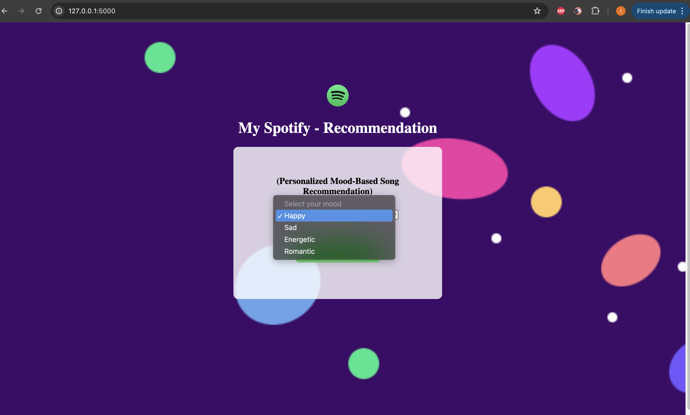
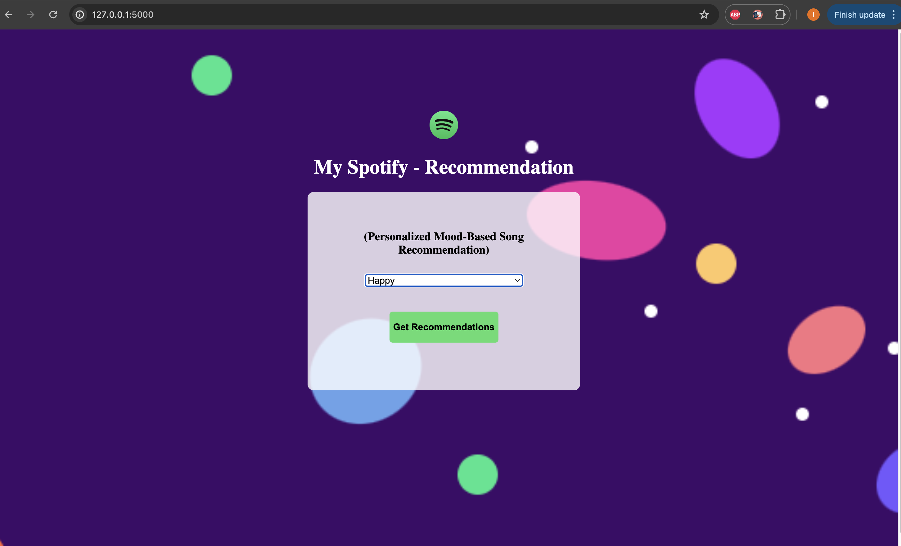
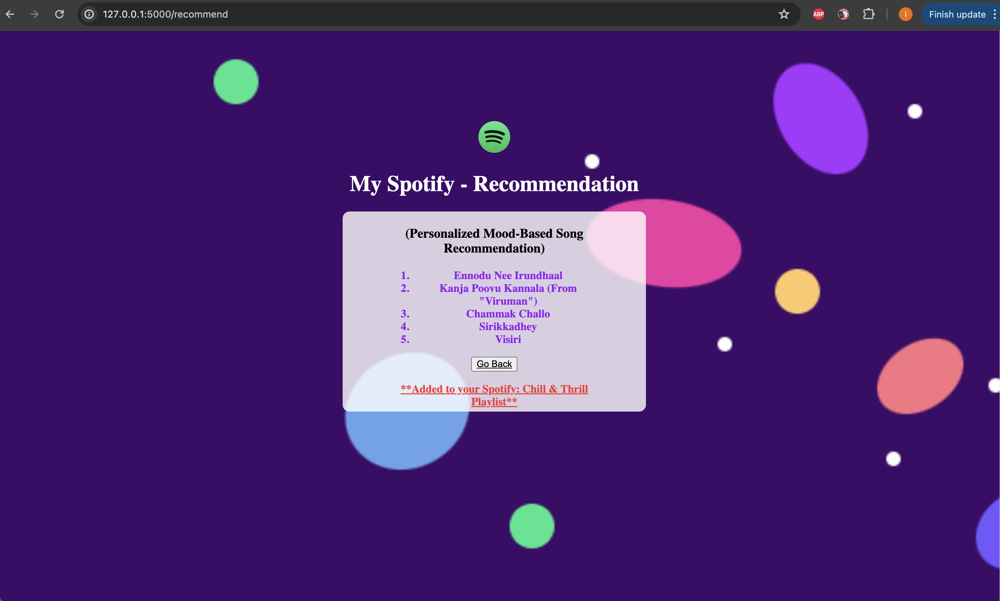
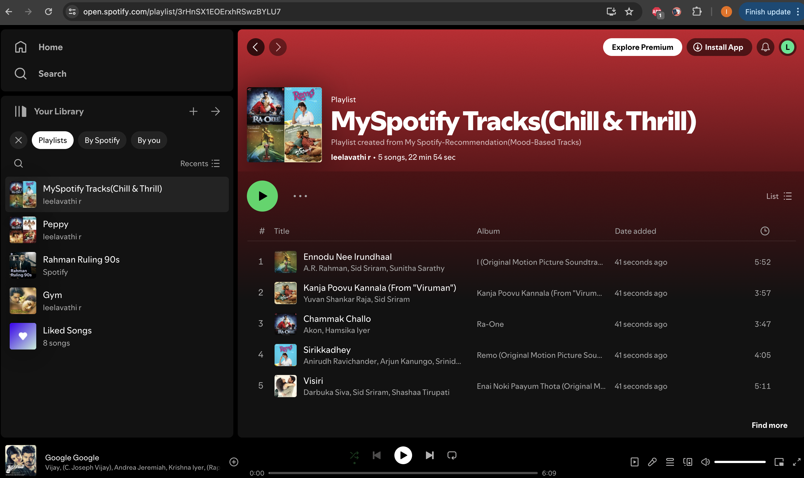

<h1 align="center">My Spotify Recommendation</h1>

My Spotify Recommendation is a web service that suggests 5 mood-based tracks and automatically creates a playlist with those tracks in my account based on my listening history which has been collected using the [Spotify API](https://developer.spotify.com/). Track moods are determined using the [Cohere API](https://cohere.com/), and the service recommends mood-based songs similar to the tracks that match the user-given mood.

## Requirements
* python >= 3.0
* spotipy
* flask
* Spotify developer credentials
* cohere developer credentials
* up-to-date lyrics dataset

## Demo:
User input page:

Selecting 'Happy' tracks:

Recommended 'Happy' tracks:

Playlist added to my Spotify:

